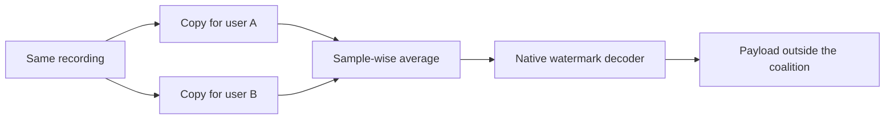

# Averaging Collusion Breaks Traceability in Personalized Neural Audio Watermarking

> Two valid personalized copies can be enough to evade recipient tracing:
> sample-wise averaging causes **86.3–99.3% tracing failure at K=2** across five
> evaluated neural audio watermarking systems.

This repository is the public code, data, and reproducibility companion for the
paper. It contains the released evaluation records, complete result tables,
audio examples, and the scripts used to run and verify the experiments.

## 🎧 [Open the five-system interactive audio demo](https://silwan5z.github.io/neural-audio-watermark-collusion-attack/#demo)

Compare the source recording, two valid personalized copies, and their 50/50
average directly in the browser. The page includes all five evaluated systems,
with coalition outcomes and quality metrics for the same K=2 trial.

**[Results and complete tables](RESULTS.md)** ·
**[Released data](data/README.md)** ·
**[Demo provenance](demos/README.md)** ·
**[Reproduce the evaluation](REPRODUCIBILITY.md)**

The manuscript PDF is not distributed in this repository. The tables below
and in [`RESULTS.md`](RESULTS.md) are the public numerical companion to the
current submission; citation metadata will be added when an archival version
is available.

## Attack overview

The attacker obtains multiple valid copies of the same recording, each carrying
a different recipient payload. Uniform averaging requires no clean reference,
model parameters, gradients, or decoder queries.



The shared audio remains aligned while the payload-dependent watermark signals
are combined. If the decoded payload matches neither contributor, the coalition
has escaped tracing. A stronger, payload-aware experiment called
**Target-Bit Margin** adjusts mixture weights toward a selected nonmember.

## Key findings

| Question | Main result | Evidence |
|---|---|---|
| Can two valid copies evade tracing? | K=2 tracing failure is **86.3–99.3%** across the five systems | [Uniform averaging](RESULTS.md#uniform-averaging) |
| Is the effect limited to perfect alignment? | Mean K=5 TF stays **96.7–97.7%** for aligned and tested ±10/20/50 ms conditions | [Temporal offsets](RESULTS.md#temporal-offsets) |
| Does lossy coding remove the attack? | Mean K=5 TF is **96.67% / 96.87% / 96.47%** for none / MP3 / Opus | [Lossy coding](RESULTS.md#independent-lossy-coding) |
| Do decoder families follow the same mixture path? | **99.7%** of AudioSeal paths remain on their endpoints versus **37.7%** for VoiceMark | [One-bit paths](RESULTS.md#one-bit-mixture-paths) |
| Can an attacker select the wrong identity? | Target-Bit Margin reaches **92.3%** target success on TimbreWM at K=8 | [Targeted control](RESULTS.md#target-bit-margin) |
| Is confidence screening a complete defense? | No. It reduces the evaluated attacks but is preliminary and non-adaptive | [Confidence screening](RESULTS.md#confidence-screening) |

## Evaluation at a glance

| Scope | Setting |
|---|---|
| Systems | AudioSeal, WavMark, TimbreWM, VoiceMark, and WMCodec |
| Decoder families | Three bit-based and two latent-based systems |
| Data | 300 ten-second speech recordings from 100 AISHELL-3 and LibriSpeech speakers |
| Coalition sizes | K = 2, 3, 5, and 8 |
| Source validity | Every personalized copy must decode correctly before mixing |
| Processing | Embedding, mixing, and decoding at each system's native sample rate |
| Released evidence | Trial-level records, summaries, checksums, and listenable examples |

## Repository guide

```text
README.md             Project overview and the shortest path into the release
RESULTS.md            Main-paper tables and all additional evaluation results
REPRODUCIBILITY.md    Protocol definitions, commands, and interpretation limits
data/                 Verified records, compact summaries, schemas, and hashes
demos/                Clickable personalized copies and colluded audio examples
scripts/              Experiment runners, summarizers, figures, and validators
src/                  Shared dataset, registry, and watermark interfaces
dataset/              Fixed 300-recording evaluation manifest
third_party/          Model adapters and configurations used by the evaluation
references/           Bibliography and background papers
tests/                Release and confidence-screening tests
```

The full speech corpus, model weights, embedding caches, runtime shards,
generated figures, logs, and manuscript drafts are intentionally excluded from
Git. Fresh experiment outputs are written under the ignored `results/`
directory; released records under `data/` are never silently overwritten.

## Verify the release

Verifying the published records does not require model weights or a GPU:

```bash
python scripts/verify_release.py
python -m unittest discover -s tests -v
```

The verifier checks record counts, schemas, source-copy validity, shared
coalitions, aggregate values, demo consistency, naming, and every checksum in
[`data/manifest.csv`](data/manifest.csv).

For a full model rerun, start with [REPRODUCIBILITY.md](REPRODUCIBILITY.md) and
the experiment map in [scripts/README.md](scripts/README.md).

## How to interpret the claims

- **Tracing failure means coalition escape.** It does not always mean that a
  deployed registry assigns the output to a real innocent user. Sparse-registry
  outcomes are separated into registered-nonmember and unassigned outputs in
  the [registry analysis](RESULTS.md#partial-registry-occupancy).
- **Uniform averaging is the practical black-box attack.** Target-Bit Margin is
  a stronger payload-aware setting and should be interpreted separately.
- **Confidence screening is preliminary.** The reported evaluation is
  non-adaptive and does not establish a collusion-resistant defense.
- **The empirical scope is speech.** Music, environmental audio, and
  heterogeneous content have not been evaluated here.

## License

The original project code is released under the [MIT License](LICENSE).
Bundled third-party components, model weights, datasets, and reference papers
remain under their original terms; see
[`third_party/README.md`](third_party/README.md),
[`dataset/README.md`](dataset/README.md), and
[`references/README.md`](references/README.md).
